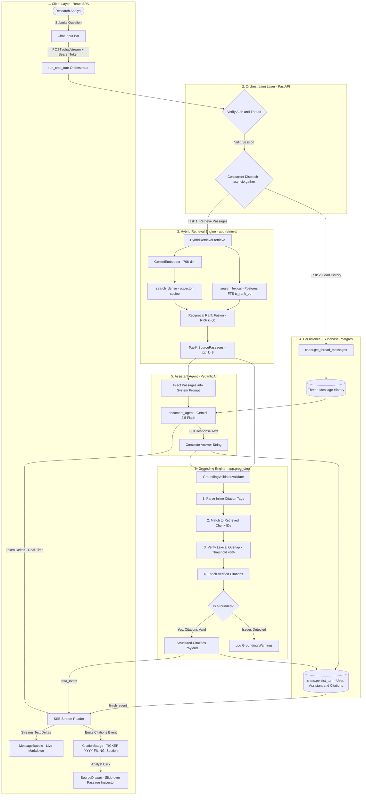

# Grounding Engine (`app.grounding`)

The grounding module is the core trust and verification engine of **Document Copilot**. It guarantees that every statement, metric, and finding delivered to equity research analysts is strictly derived from verified SEC filings, complete with auditable citations.

---

## The Grounding Contract

For hedge fund analysts at Driftwood Capital, ungrounded hallucination is catastrophic. The system operates under a strict four-part grounding contract enforced at prompt time by the PydanticAI agent and validated at output time by `GroundingValidator`:

1. **Strict Corpus Grounding:** The assistant must answer solely based on the retrieved passages provided in its context. It is strictly forbidden from using parametric LLM memory for factual corporate metrics.
2. **Mandatory Inline Citations:** Every factual claim, financial metric, and operational quote must be immediately followed by an inline SEC citation marker, formatted as:
   - `[AAPL 2024 10-K, Item 7]`
   - `[AMZN 2024 10-K, Financial Statements]`
   - `[NVDA 2024 10-K, Item 1A]`
3. **Explicit Refusal When Unsupported:** If the retrieved passages do not contain sufficient evidence to answer the analyst's question, the assistant must explicitly refuse to answer rather than speculate.
4. **Zero Speculative Investment Advice:** The assistant presents factual filing excerpts and historical data without generating buy/sell ratings, speculative price targets, or financial recommendations.

---

## End-to-End Architecture: Retrieval to Grounding & UI

The following graph map illustrates how raw analyst questions flow through hybrid retrieval, context injection, agent generation, post-generation grounding validation, and streaming to the frontend:



---

## `GroundingValidator` Mechanics

The validation logic lives in [`validator.py`](validator.py). It executes four sequential verification passes:

### 1. Inline Citation Parsing
It extracts citation tags embedded in the markdown response using the regex pattern:
```python
INLINE_CITATION_PATTERN = re.compile(
    r"\[([A-Z]{1,5})\s+(\d{4})\s+([0-9A-Z\-]+)(?:,\s*([^\]]+))?\]",
    re.IGNORECASE,
)
```
This detects patterns like `[AAPL 2024 10-K, Item 7]`, extracting the ticker (`AAPL`), fiscal year (`2024`), filing type (`10-K`), and optional section or page pointer (`Item 7`).

### 2. Passage Cross-Referencing
For each extracted citation, the validator searches across the `retrieved_passages` passed into the turn. A citation is matched if:
- Ticker matches passage ticker (case-insensitive).
- Fiscal year matches passage fiscal year.
- Section or page substring matches passage section (if present).

If a cited chunk was not part of the retrieved passages, an issue is flagged (`Citation references unknown chunk_id`).

### 3. Lexical Excerpt Overlap Verification
If an excerpt or quote is attributed to a passage, the validator checks token overlap against the actual chunk text:
$$\text{Overlap} = \frac{|\text{words}_{\text{excerpt}} \cap \text{words}_{\text{passage}}|}{\max(1, |\text{words}_{\text{excerpt}}|)}$$
If token overlap is below `40%`, the citation is flagged for low overlap (`grounding.low_excerpt_overlap`), catching distorted quotes.

### 4. Metadata Enrichment
Once verified, the citation is converted into a fully typed `Citation` model containing:
- `chunk_id`: Unique identifier of the source chunk in `document_chunks`.
- `document_id`: Parent filing ID in `source_documents`.
- `ticker`: SEC company symbol (e.g., `AAPL`, `AMZN`, `MSFT`, `NVDA`).
- `fiscal_year`: Filing fiscal year.
- `filing_type`: Filing category (`10-K`, `10-Q`).
- `section`: Filing section header (e.g., `Item 7. Management's Discussion and Analysis`).
- `page`: Source PDF page number.
- `excerpt`: The exact passage snippet (first 300 chars) for immediate preview.

---

## Data Structures

Defined in [`app.assistant.outputs`](../assistant/outputs.py) and [`app.grounding.validator`](validator.py):

### `SourcePassage`
Input to the assistant and validator, representing one retrieved chunk:
```python
class SourcePassage(BaseModel):
    chunk_id: str
    document_id: str
    chunk_text: str
    ticker: str | None
    fiscal_year: int | None
    filing_type: str | None
    section: str | None
    page: int | None
```

### `Citation`
Enriched citation produced by validation and sent to the frontend:
```python
class Citation(BaseModel):
    chunk_id: str
    document_id: str
    excerpt: str
    section: str | None
    page: int | None
    ticker: str | None
    fiscal_year: int | None
    filing_type: str | None
```

### `GroundingResult`
The output of `GroundingValidator.validate(...)`:
```python
class GroundingResult(NamedTuple):
    is_grounded: bool
    citations: list[Citation]
    issues: list[str]
```

---

## Testing & Verification

### 1. Automated Unit Tests
Run the deterministic grounding test suite:
```bash
cd backend
uv run pytest tests/grounding/test_validator.py -v
```
Verifies:
- Extraction of multiple inline SEC citations.
- Correct matching against passage lists.
- Rejection of invalid chunk IDs and fabricated quotes.
- Safe handling of empty or ungrounded responses.

### 2. Live Smoke Testing with `smoke_assistant.py`
Run single or parallel live verification against the database and Gemini LLM:

```bash
# Single benchmark query with streaming and stage-by-stage logs
uv run python scripts/smoke_assistant.py amazon

# Parallel benchmark suite (runs 5 queries concurrently via asyncio.gather)
uv run python scripts/smoke_assistant.py --all
```

### 3. Interactive Jupyter / REPL Usage
In a Jupyter notebook or IPython session:

```python
from scripts.smoke_assistant import run_query, run_checks_parallel

# Test a single query
result = await run_query("amazon")
print(result.is_grounded, len(result.citations))

# Run all benchmarks in parallel
results = await run_checks_parallel()
```

---

## Related Modules
- [`app.retrieval`](../retrieval/README.md): Hybrid search engine (pgvector + FTS + RRF) generating `SourcePassage` instances.
- [`app.assistant`](../assistant/): PydanticAI agent definition and system prompt enforcement (`instructions.md`).
- [`app.chat.orchestrator`](../chat/orchestrator.py): Coordinates retrieval, streaming, grounding validation, and persistence.
