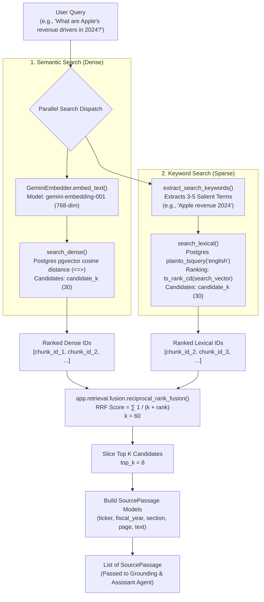

# Retrieval Engine (`app.retrieval`)

The retrieval module is responsible for hybrid search across SEC filing chunks stored in Supabase Postgres. It balances semantic understanding (via `pgvector`) with exact keyword matching (via Postgres full-text search) and merges results using Reciprocal Rank Fusion (RRF).

---

## Visual Pipeline



---

## How the Pipeline Works

1. **Query Preprocessing & Filtering:**
   The search query is stripped and validated. Optional filters can be applied for:
   - `ticker`: Target company symbol (e.g. `AAPL`, `MSFT`)
   - `fiscal_year`: Target filing year (e.g. `2024`)
   - `filing_type`: Filing category (e.g. `10-K`, `10-Q`)

2. **Parallel Retrieval Execution:**
   The retriever dispatches two concurrent queries via `asyncio.gather()`:
   - **Dense Branch:** Embeds the query into a 768-dimensional vector using Google Gemini and executes an HNSW-indexed cosine distance similarity query against `document_chunks.embedding`.
   - **Lexical Branch:** Executes full-text search against `document_chunks.search_vector` using Postgres `plainto_tsquery('english', query)` and cover density ranking (`ts_rank_cd`).

3. **Reciprocal Rank Fusion (RRF):**
   Because cosine distances $[0, 2]$ and `ts_rank_cd` scores $[0, \infty)$ live on non-comparable scales, they are combined purely by rank position:
   $$\text{RRF\_score}(d) = \sum_{r \in \text{rankings}} \frac{1}{k + \text{rank}_r(d)}$$
   Items appearing near the top of both dense and lexical rankings receive strong score compounding.

4. **Passage Packaging:**
   The top $K$ fused chunk IDs are mapped to full chunk metadata, producing structured `SourcePassage` objects ready for grounding validation and assistant reasoning.

---

## Default Settings & Parameters

All retrieval settings are centralized in `app.config.settings` and can be overridden via `.env`:

| Setting | Setting Field in `app.config.settings` | Default Value | Description |
| :--- | :--- | :--- | :--- |
| **Top K** | `retrieval_top_k` | `8` | Final number of fused passages returned to the agent |
| **Candidate K** | `retrieval_candidate_k` | `30` | Candidates fetched per branch before fusion (30 dense + 30 lexical) |
| **RRF K** | `retrieval_rrf_k` | `60` | Smoothing constant for RRF (balances top vs lower-ranked items) |
| **Neighbor Radius** | `retrieval_neighbor_radius` | `1` | Number of adjacent chunks retrieved before/after for grounding context |
| **FTS Config** | `retrieval_fts_config` | `"english"` | Full-text search dictionary language (`plainto_tsquery`) |
| **Embedding Model** | `embedding_model` | `"gemini-embedding-001"` | Google Gemini query embedding model |
| **Embedding Dims** | `embedding_dimensions` | `768` | Output vector dimensionality for pgvector search |

---

## File Overview

- **`retriever.py`**: The high-level orchestrator class `HybridRetriever` combining embedding, parallel retrieval, and fusion.
- **`keywords.py`**: High-performance extractor distilling 3–5 salient search terms from conversational queries for lexical Postgres FTS.
- **`fusion.py`**: Core mathematical implementation of the Reciprocal Rank Fusion algorithm.
- **`queries.py`**: Direct database access helpers executing SQLAlchemy/Postgres queries (`search_dense`, `search_lexical`, `get_surrounding_chunks`, `get_chunks_by_ids`).
- **`__init__.py`**: Public export surface for the module.

---

## Quick Usage

```python
import asyncio
from app.retrieval import HybridRetriever

async def main():
    retriever = HybridRetriever()
    passages = await retriever.retrieve(
        query="What were the drivers of AWS operating margin in 2024?",
        ticker="AMZN",
        fiscal_year=2024,
        top_k=5,
    )
    for p in passages:
        print(f"[{p.ticker} FY{p.fiscal_year} {p.section} p.{p.page}]")
        print(p.chunk_text[:200], "\n")

if __name__ == "__main__":
    asyncio.run(main())
```

---

## Related Modules

- **[`app.grounding`](../grounding/README.md)**: Validates that LLM responses cite retrieved passages accurately, extracts inline citations, and prevents hallucinations.
- **[`app.assistant`](../assistant/)**: PydanticAI agent orchestrating prompt injection and model reasoning.
- **[`app.chat.orchestrator`](../chat/orchestrator.py)**: Coordinates parallel history retrieval, passage search, and real-time streaming.
